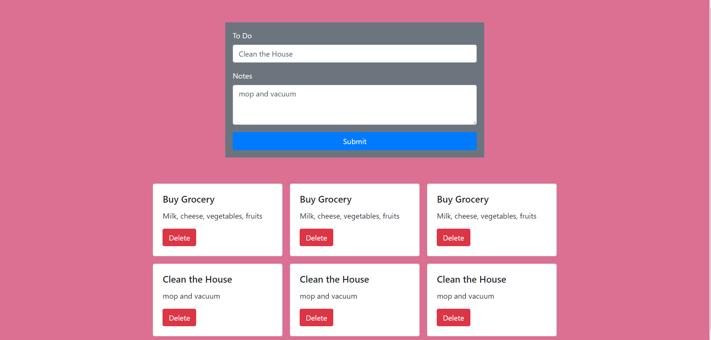

# Event Listeners
This project is an exploration of event listener function and bootstrap for styling. 
I built To Do cards and notes using form with submit button which prints todo and notes below the form .
I also added event listener for those cards to be able to individually delete it. 
I added styling using bootstrap framework.


## Screenshots


## How to run this project
* Use npm to install http-server in your terminal:
```
npm install -g http-server
```
* Run the server
```
hs -p 9111
```
* Open chrome and navigate to :
```
localhost:9111
```
